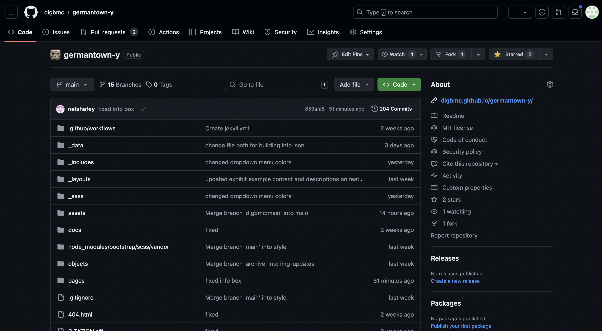
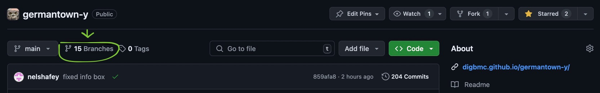
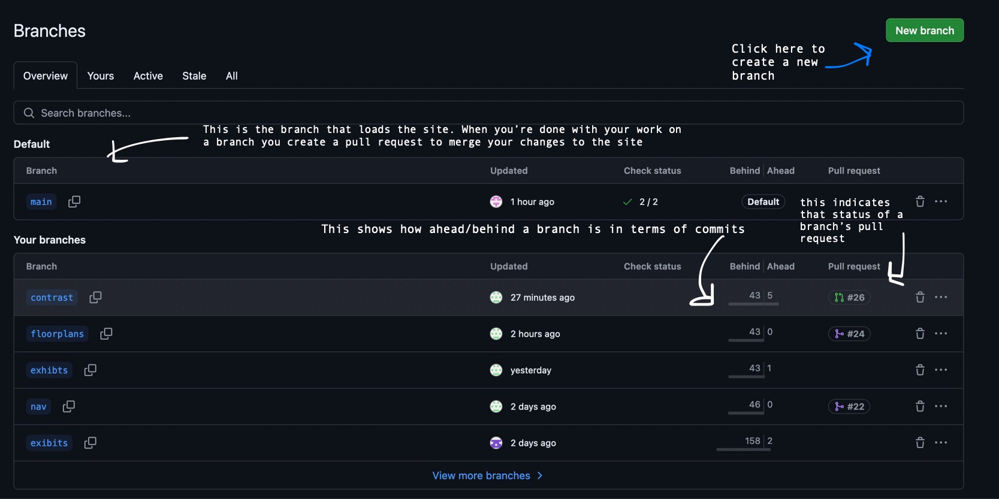
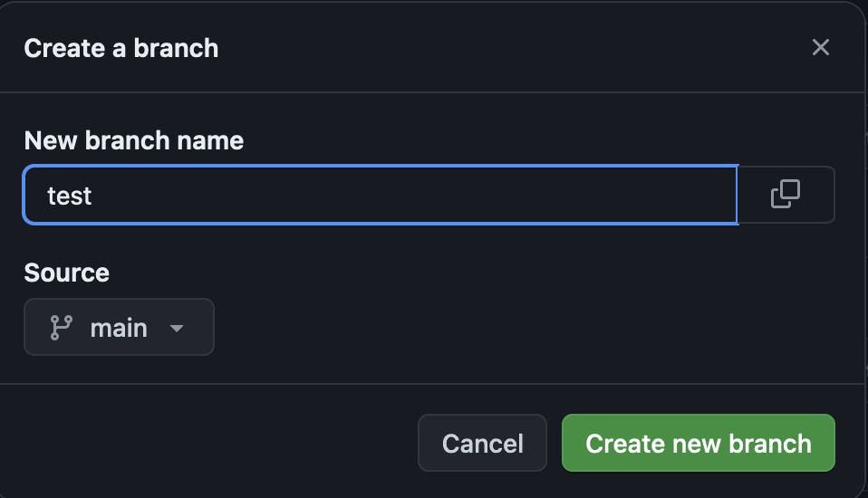
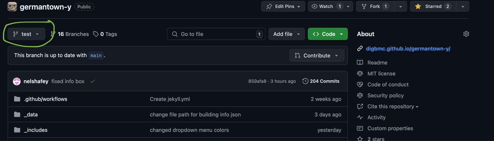
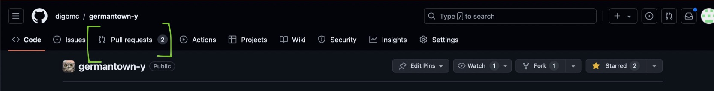

# Getting started

<!-- any and all images here should have alt text attached to them -->

Before you start working on the Germantown-YWCA website, here are the major tools used on the site.
- [Git](https://git-scm.com/) is an open-source version control tool that allows people to work with different versions of a project together.  
- [GitHub](https://github.com/) is a platform for hosting projects that use Git. The Germantown YWCA Website is hosted and deployed using Github.
- [Jekyll](https://jekyllrb.com/) is a static site generator that works with GitHub to generate the site.
- [CollectionBuilder](https://collectionbuilder.github.io/) is a Jekyll-based framework for hosting digital archives. It's used as the template for this site.

This guide will set you up with all the software you need to start working with the site. For content editing, working on GitHub will be easier. For more advanced work, you'll have to work with the repository stored on your computer.

## Terms to know

Technical terms can be a lot. Here are some that you may see in our documentation.

- Open-source: Software that is free to use, with accessible source code.
- Hosting: Where files are stored. A text file on your computer is hosted locally. A Google doc is hosted on Google's servers. The Germantown YWCA site is hosted on GitHub
- Deployment: To make a site live. GitHub has a feature called [GitHub Pages](https://pages.github.com/) that turns a repository into a website.
- Static-Site: [A static site](https://en.wikipedia.org/wiki/Static_web_page) is built with HTML, CSS, and JavaScript. The Germantown-Y site is a static site. It regenerates when the site is updated. This is different from dynamic sites, which generate in browser every time someone opens the page. Static sites load faster and are move [environmentally friendly](https://www.websitecarbon.com/how-does-it-work/) than dynamic sites.
- Remote: The repository stored on GitHub. A repository is a folder where all the code for a project is stored. Multiple people work on the remote repository.

- Local: The repository stored on your computer. Communicates with the remote repository using Git. A project can have multiple local repositories (for example, one for each team member), and all of those repositories collaborate with the remote repository.

Before you start working on the Germantown YWCA, you'll need a GitHub account. To do that [Sign up for a Github Account](https://github.com/signup?ref_cta=Sign+up&ref_loc=header+logged+out&ref_page=%2F&source=header-home).

Once you have an account, open up the [germantown-y repository](https://github.com/digbmc/germantown-y). It looks like this:

GitHub works with a version control system called Git, which allows for project collaboration. Instead of everyone working on the same version of the project, Git has a feature called [branching](https://git-scm.com/book/en/v2/Git-Branching-Basic-Branching-and-Merging). Branches are copies of the main branch you can work on, without affecting the main branch/site.

## Create a new branch

1. Click on branches to navigate to the page.

Once you click that button, you'll arrive on the branches page

This is where you'll find all the information you need to know about the branches you're working on.
2. Click on the new branch button
3. Enter the name of your new branch. It can be anything, but it's helpful to name it after what you're planning to work on. Unless you're trying to work off someone else's branch, leave the source as main. Click the create new branch button

4. Under the your branches section, your new branch should appear. Click on it.
Now, with your branch created, you have an exact copy of the main site to work with.
 Make sure to check what branch you're working on before you start changing things.
5. Make changes (we'll get into this later, but for now this is just an outline of what your workflow will look like)
## Merging your work with the site
After you've finished making your changes in the branch, you can create a pull request to merge them into the main site. A pull request sends a request to GitHub to merge your branch into main. Merge meaning your changes will move from the branch you're working in into the main branch, becoming visible on the site. When you create a pull request, a site administrator will look at it to make sure none of the code conflicts with the main branch. Once there are no conflicts, your branch will be merged, and your changes will be live on the site.

1. Click on the pull request button from the main menu

2. On the pull requests page, click on the button titled new pull request.
3. change the compare branch to the branch you want to merge
Note: The pull request page will load with the files you're trying to change and if the branch can automatically merge. If your branch can't automatically merge, you can still create a pull request. A site administrator can fix the conflict.
4. Click, the create pull request button
5. You've created a pull request! Assuming there are not major issues, your changes to the site should be live soon.
