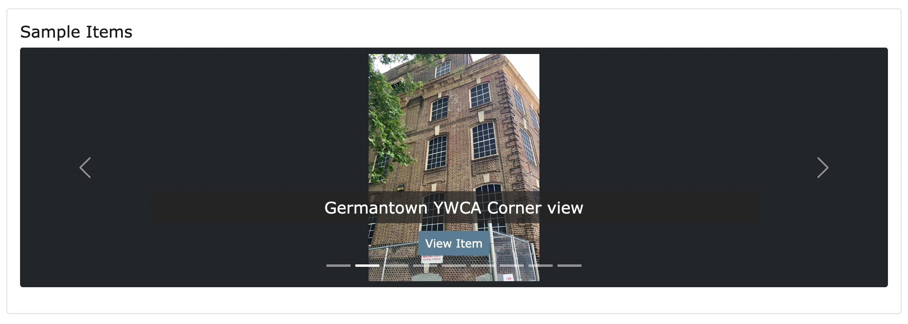

# Carousel 

The image carousel is a moving slide show of images from the[archive](https://digbmc.github.io/germantown-y/archive.html). Carousels can be found on the [building page](https://digbmc.github.io/germantown-y/building.html) and the [home page](https://digbmc.github.io/germantown-y/).

A carousel looks like this: 


## Random Carousel
The carousel on the homepage picks the images randomly from the meta-data. There are 9 slides. 

To add a random image carousel, use the include ``````

Title and height are parameters. Changing them will change the way the carousel looks. 

Other parameters that can be included (from the Collection Builder documentation) :
 - "header" = text header above the carousel (optional)
 - "max" = maximum images selected for slide show (optional, default 9. Do not make this number too big!)
 - "btn-color" - a bootstrap color class to theme the buttons. Can be any bootstrap template color (e.g. info, success) or outline (e.g. outline-info, outline-success), including colors created in config-theme-colors. (optional, default "primary") [Bootstrap's list of colors](https://getbootstrap.com/docs/5.0/customize/color/) have been changed. The names of the colors are the same, but the color values are different. The colors are listed in [config-theme-colors](../_data/config-theme-colors.csv)
 - "btn-text" - the label used in the link btn to view the carousel item (optional, default "View Item")

 For example, If I wanted to include a carousel with a custom header, and light blue buttons, I would add these parameters: 
 ``

## Custom Carousel
The Carousel on the building page is a custom one. The images are specified in a list of object IDs featured in the front matter of [building.md](../pages/building.md): 

``` 
gallery:
- arc_001
- arc_002
- arc_003
```

The images can be changed, but like the random Carousel, the maximum amount of images is nine. The images will appear in the order listed. 

 To include a custom carousel use `````` The same parameters used for random can be applied to custom. Make sure that if you're using a custom gallery on a new page you include a gallery list.

