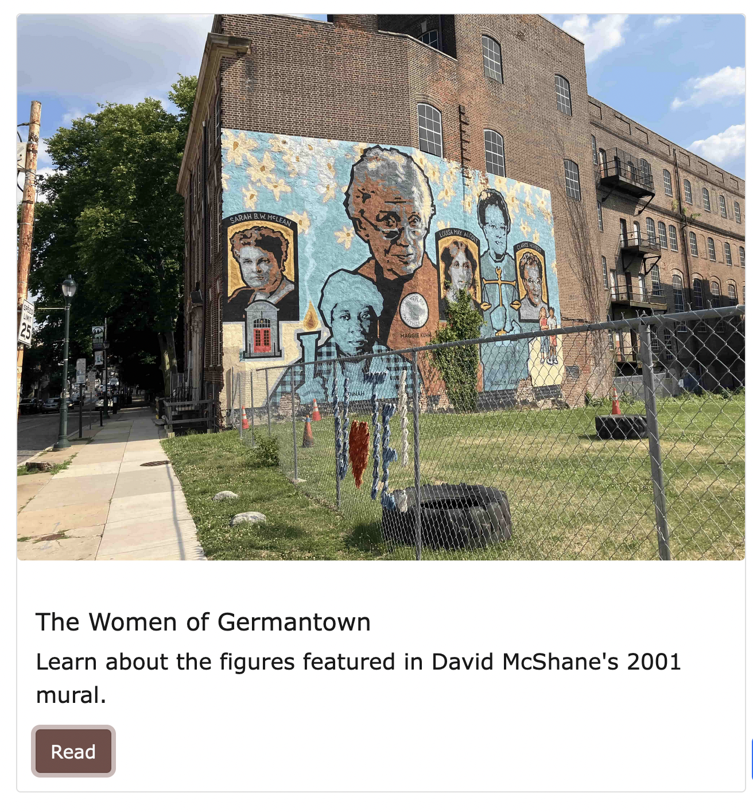

# How to Create a New Exhibit 

An Exhibit is essentially like a blog post, pages you can create for projects/research into the YWCA. They allow new stories to be told about the building and its history. 

To create an exhibit, open the _exhibts folder from the repository and create a new markdown folder. The title should be lowercase, with words separated by dashed (ex. history-of-pool.md)

Before you start writing and adding content, you'll need to change the front matter, variables at the top of your markdown files. The front matter for an exhibit page looks like this: 

```
---
title: The Women of Germantown
description: Learn about the figures featured in David McShane's 2001 mural.
author: Emma
img: arc_008

---

```

This information is important for creating the preview for your page and banner for your page. An Exhibit page looks like this: 


The title is from the title variable, the author from the author variable, and the image from the img variable. "arc_008" is an objectID from the metadata. Images used for the exhibit should be referenced by objectID (note to self: link to metadata documentation) 

The information is also useful for the card preview. 


This uses the same front matter, with the difference being that author is swapped for description. The description variable is where a short description/preview of your page should be put. 

After you've set all that up, start adding content below the front matter (link on how to do that??)

# How to Add Images the Exhibits Page 
Go to [Adding Content](./adding-content.md) where you will find a subsection called 'images.' From there, it will guide you on how to add images like the one displayed currently. 
