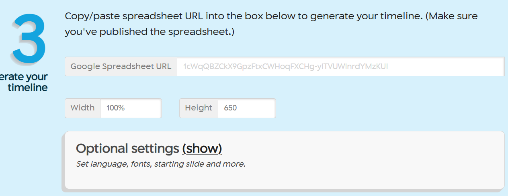
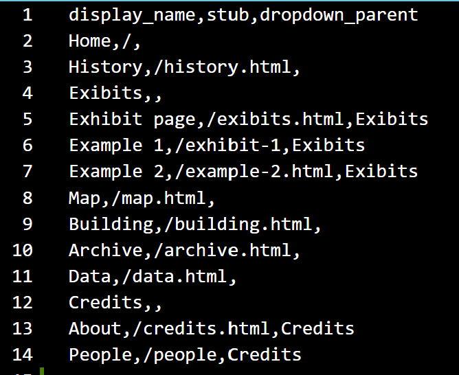
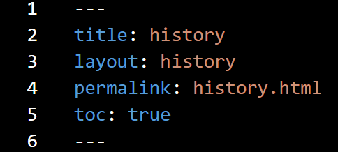

---
title: documentation
author: Fiona
--- 

## Timeline ##
- Start off by using Timeline js to download the spreadsheet 
[Timeline js Documentation]("https://timeline.knightlab.com/)

## Working with Spreadsheet ##
### Dates ###
- Only use numbers 
- To use words like January, input text into the Display Date column

### Text styling ###
- To change the color of the text, input html elements such as "carrot sign/less than sign" span style="color: black;">Text "carrot"/span>
- To bold text, use carrot strong carrot

### Images ###
- For adding images always use the image url and copy/paste it into the "Media column"
- To input background image, copy the image url into the "Background column"

### Background color ###
- input the color in words or use a CSS hex color. For example, inputting “lightblue” or #8BB1C4. Don’t forget the pound/hashtag sign # when inputting a hex color

### Organizing ###
- Using the group colummn, you can organize the slides by groups (tags)
- Events with the same group will be put in the same row 

After working with the spreadsheet
- publish your timeline under the file menu in the spreadsheet
- click share and publish
- copy and paste the URL to timeline js website

### Changing Font ###

## History Page ##
- The layout defined will automatically apply, embedding the iframe and organizing the content as described.

### Container with an Embedded Iframe ###
- This section contains a container div with an embedded iframe displaying content from an external source, which in this case is the timeline
- The div tag defines a division or a section in an HTML document. It is used as a container for HTML elements which is then styled with CSS or manipulated with JavaScript. It is easily styled by using the class or id attribute.
- Any sort of content can be put inside the div tag! 

### Description Box ###
- The second div serves as a placeholder for any additional description or content you might want to add later.

### Classes and Bootstrap Grid System ###
- The container class is used to contain the content within a fixed-width container.
- The my-4 class adds vertical margin 
- The about-contents class is a custom class that you can define in your CSS to style the about page content.
- The row class is a Bootstrap class that creates a horizontal group of columns.

### Markdown File ###
- title: Sets the title of the page. This will be used as the page title and can also be displayed in various parts of the site depending on the template.
- layout: Specifies that the page should use the "history" layout. This should correspond to a layout file named history.html in the _layouts directory.
- permalink: Sets a custom URL for the page. In this case, the page will be accessible at history.html.
- toc: Enables the table of contents for the page. This is a custom variable that is handled in your layout file. 

## Nav Bar ##
To create a nav bar to change the items listed in a nav bar, edit the config-nav.csv file 
 

- The format shows as follws: parent,/ url, children
- Parent: Indicates the menu item or section under which the current page is nested.
- URL: The path used to access the page.
- Children: Indicates pages or sections that are nested under the current page. 
So then there is the structure of parent, url, children

### Navigation Flow ###
- From the Home page (/), you can navigate to History (/history.html).
- The Credits menu item has two subpages: About (/credits.html) and People (/people).

## Adding Content ##
- every page has a markdown and html file
- in the markdown file, there is a YAML font matter at the top like so

 

## Adding Images ##
- To add images to the site, upload the image file to the site repository 
- To upload:
    - add the image to img folder in the assets folder. You can do this by 
        1. adding the image file to the /assets/images folder in your local branch and committing and pushing your changes to your remote branch in Github
        2. by uploading a file to your remote branch in GitHub
    - the file name should not include spaces. Use dashes or underscores instead
    